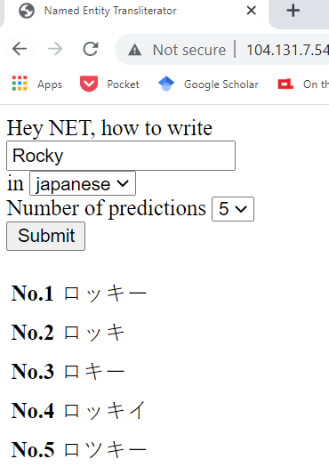

## Named Entity Transliterator

 

This is a repository for Named Entity Transliterator (NET). NET is a tool that
allows users to interact with Named Entity Transliteration models. Currently,
NET supports `Arabic`, `Chinese`, `Hebrew`, `Japanese`, `Korean`, and `Russian`,
and provides prediction by [Phonetisaurus](https://github.com/AdolfVonKleist/Phonetisaurus).

Our models is trained with [NETransliteration-COLING2018](https://github.com/steveash/NETransliteration-COLING2018).

## How to install

1. Train `Phonetisaurus` model following this [repo](https://github.com/steveash/NETransliteration-COLING2018).
1. `git clone` this repository.
1. `cd net-app`.
1. Move trained Phonetisaurus model (`*.fst`) to `model_store` in the following format:
   `model_store/{language}_ps_1/model.fst`, e.g. `model_store/korean_ps_1/model.fst`.
1. Run `pip install phonetisaurus` or follow [here](https://pypi.org/project/phonetisaurus/).
1. In the root directory of this repo, install dependencies by `pip install -r requirements.txt`.
1. Run the server by `gunicorn web.wsgi_phonetisaurus:app`.

## Future Plan

A transformer model in PyTorch will be added soon. It's under development now.
